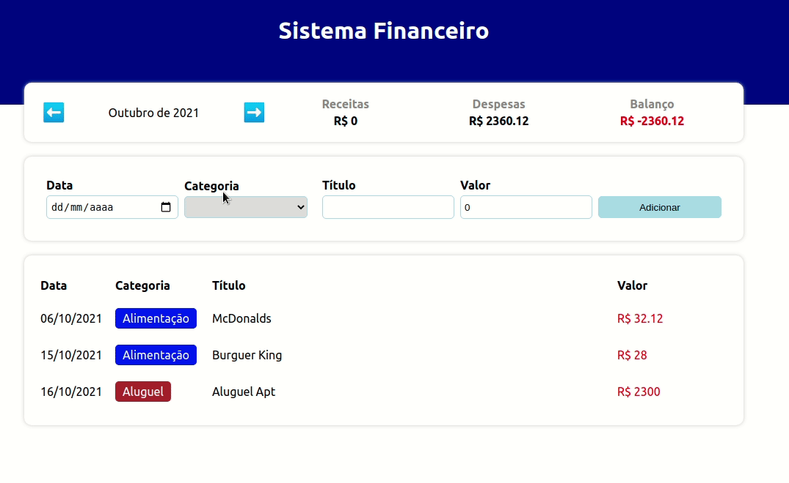

<h1 align="center">Sistema Financeiro</h1>

Este projeto foi criado como forma de estudar Hooks do React.js e Date.

### Features
- [x] Adicionar Despesas ou Receitas
- [x] Total de Despesas e Receitas do Mês 
- [x] Balanço Mensal
- [x] Conferir informações de outros meses

<a href="https://sistema-financeiro-lilac.vercel.app/">Visualizar Online</a>

 

### Tecnologias
As seguintes tecnologias foram usadas no projeto:
- Typescript
- React.js
- Styled Components
- useState / useEffect
- dateFilter

### Autor do Projeto
- Alex Santos

